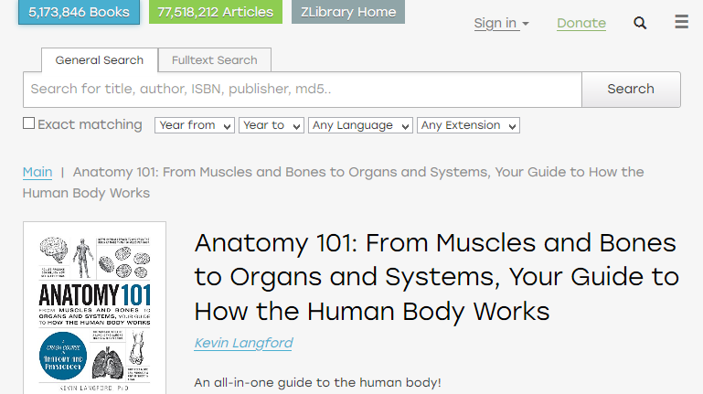

# ZLibrary Book Page Search Bar

## Description

Adds a search bar on book pages. Search new books or articles without going back to the main page.

## Screenshots

## How to install the script

1. Install one of these browser extensions: [Violentmonkey](https://violentmonkey.github.io/get-it/) / [Greasemonkey](https://www.greasespot.net/) / [Tampermonkey](https://tampermonkey.net/)
2. Go to the script [page](https://greasyfork.org/en/scripts/406333-zlibrary-book-page-search-bar)
3. Press **Install this script** button
4. Confirm the installation

## License

This work is free. You can redistribute it and/or modify it under the
terms of the Do What The Fuck You Want To Public License, Version 2,
as published by Sam Hocevar. See the [full WTFPL text](http://www.wtfpl.net/txt/copying/) for more details.